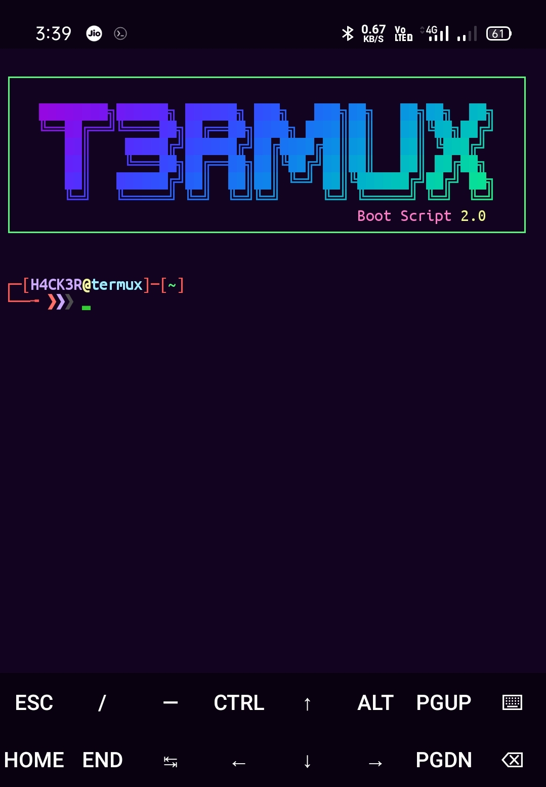

# Termux-Banner-Bash Shell by yoshi

<p align="center">
     Trim Dir | Prompt username | termux extra kyeboard |
     popups key | new session open with hot key | swich between session with hot key
</p>
## Extra-Keyboard configuration
According to termux version (Termux v0.95) Extra Keyboard work. plz be sure about that you have v0.95 termux.
## Preview Screenshot

<p align="center">
  
</p>

## Preview of setup 

<p align="center">

</p>

## setup instruction

```
git clone namamu cd Termux-Banner-Bash; bash setup; 

```
